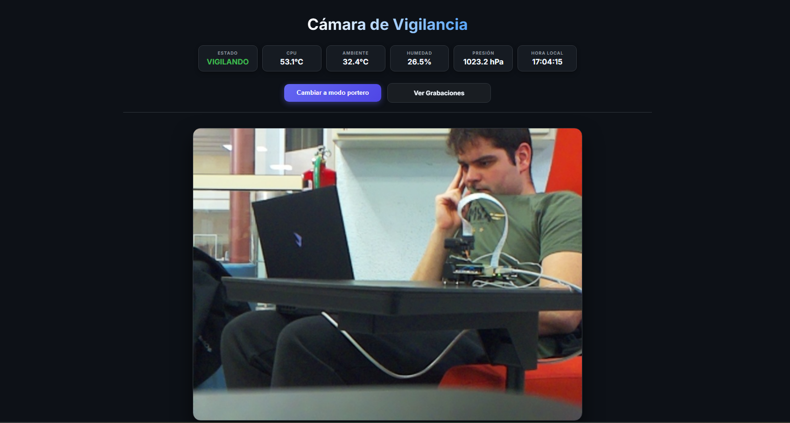
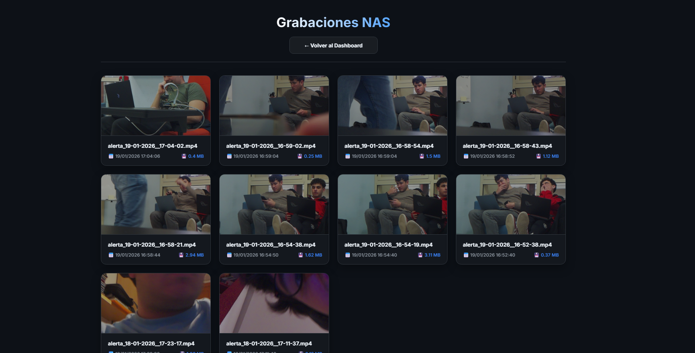
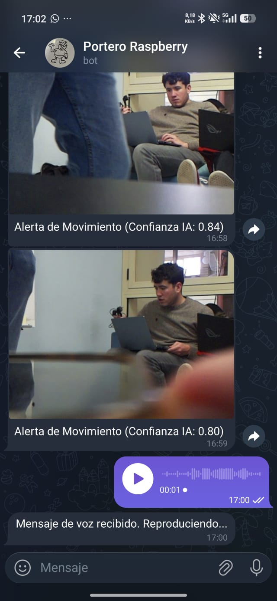
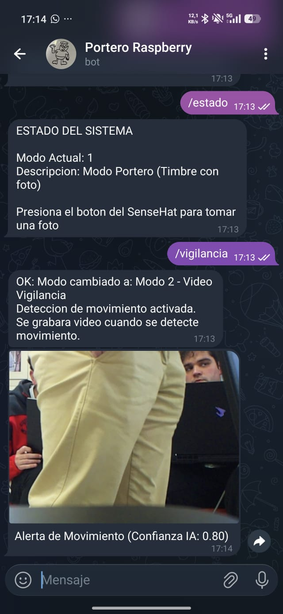
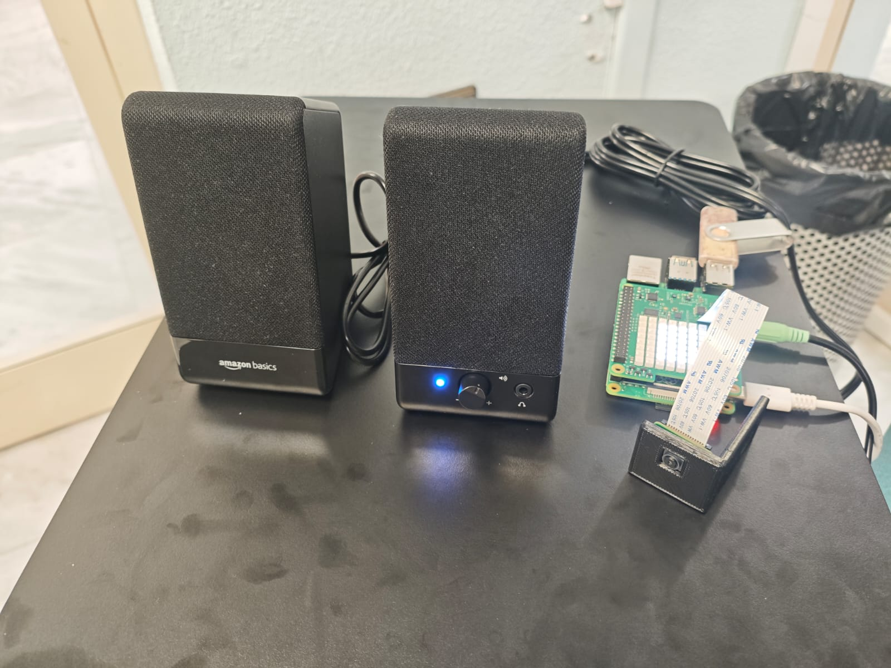

# 🛡️ Smart Surveillance System with Local NAS

This project is an advanced **Edge Computing** security solution that transforms a Raspberry Pi 4 into a professional surveillance system. It uses artificial intelligence for person detection, automatically manages storage on a NAS drive, and allow full control through a web interface and Telegram. 🚀

System usage is simple:
- When you are at home and want to know who is at the door, with **Doorbell Mode** activated, when someone rings the bell, the system will play a high-quality chime sound and send a photo to Telegram.
- When you are away and want the camera to send you a photo when it detects movement, with **Surveillance Mode** activated, when someone approaches the house, the system will notify you via Telegram and save a video of the moment on the NAS. This way, you can have complete knowledge of who tried to enter your home.
- You can access the videos from any device and anywhere in the world with the Tailscale app. Thus, going on vacation won't be a problem.
- The system is smart and will only send you alerts when a person is detected in the camera's field of view.
- You can send audio messages from Telegram for the system to play, warning intruders that they are not welcome.
- The system is highly customizable, allowing you to adjust camera parameters, motion detection, recording, storage, audio, remote access, Telegram, and operation mode.

## 📁 Current Project Status

The system has evolved from a basic camera script to a modular and robust infrastructure that includes:

- **Integrated AI**: Person detection using MediaPipe to eliminate false alarms.
- **NAS Management**: Automatic disk cleaning and video retention policies.
- **Dual System**: Switch between **Smart Doorbell** and **Security Camera** modes.
- **Remote Access**: Integrated VPN to view your home from anywhere.
- **Voice Control**: Playback of messages sent from Telegram.

---

## 🔄 1. Operation Modes

The system allows you to alternate between two main configurations based on your needs:

### 🔔 Mode 1: Doorbell
Designed to be the heart of your entrance.
- **Trigger**: Physical press of the center button on the SenseHat.
- **Actions**:
  - 🔊 Plays a high-quality doorbell sound.
  - 📸 **Smart Capture**: The system waits for `TELEGRAM_ALERT_DELAY` and then analyzes bursts of images for 2 seconds to send to Telegram the photo where the person is best seen.
- **Usage**: Ideal when you are at home and want to know who is calling at the door from your mobile.

### 🎥 Mode 2: Video Surveillance
24/7 active surveillance with AI.
- **Trigger**: Motion detection using OpenCV.
- **Actions**:
  - 🔍 **AI Filter**: Instantly verifies if there is a person before recording.
  - 📹 **Automatic Recording**: Saves clips in **.mp4** format on your NAS storage.
  - 🚨 **Emergency Alert**: Sends a notification with the best capture of the person to Telegram.
  - 🛑 **Smart Stop**: If the person leaves the frame, the recording stops after 2 seconds of absence to save space.
- **Usage**: Perimeter security and intruder detection.

---

## 🧠 2. System Architecture (Core)

The software is divided into independent modules coordinated by `run.py`:

- **`camera.py`**: Manages Picamera2 logic, frame processing, and motion detection.
- **`detector.py`**: AI engine based on MediaPipe. Uses the `efficientdet_lite0.tflite` model to recognize humans with high precision.
- **`storage.py`**: The "NAS cleaner." It ensures the disk doesn't fill up by following two rules:
    1. **Age**: Deletes videos older than `MAX_DAYS_STORAGE` (default is 7 days).
    2. **Capacity**: If disk usage exceeds `MAX_USAGE_PERCENT` (85%), it frees up space by deleting the oldest files.
- **`sensors.py`**: Manages the SenseHat (temperature, humidity, pressure) and monitors the center joystick button.
- **`telegram_service.py`**: Manages mobile communication. Allows receiving alerts and sending commands/voice.
---

## 📂 3. NAS Storage (Samba)

Your Raspberry Pi now acts as a file server (NAS) so you can view videos directly from your PC or mobile file explorer:

- **Quick Setup**: Run `bash scripts/setup_samba.sh` once.
- **Network Name**: `\\raspberrypi.local\Grabaciones` (on Windows) or `smb://raspberrypi.local/Grabaciones` (on Mac/Mobile).
- **Automatic Control**: Every time you run `run.py`, the system verifies that the NAS server is active.
- **Security**: Access is protected (configure your user with the installation script).

---

## 🖥️ 4. Web Interface and Control

Access a premium control panel from `http://<RASPBERRY-IP>:5000`:

   
  <em>Main control panel: Real-time streaming and live telemetry</em>

   
  <em>Interactive gallery: Remote management and playback of recordings</em>

- **Live Streaming**: Real-time video with minimal latency and corrected colors.
- **Recordings Gallery**: Explore and play all saved clips directly from the browser at `http://<RASPBERRY-IP>:5000/grabaciones`.
- **Telemetry**: Live charts and data for CPU and environment (SenseHat).
- **Mode Management**: Switch between Doorbell and Surveillance with a single click.
- **Visual Status**: Clear indicators of **WATCHING** or **RECORDING** with an integrated stopwatch.

---

## 📱 5. Control via Telegram

The Telegram bot is your remote control:

  
   
  <em>Smart alerts: The bot sends optimized bursts of photos when motion or doorbell activity is detected</em>

- `/portero`: Activates Doorbell Mode.
- `/vigilancia`: Activates Surveillance Mode.
- `/estado`: Detailed report of what the system is working on.
- **Voice Messages**: Send an audio message to the chat and the Raspberry will play it through its speakers immediately.

---

## 🌍 6. Secure Remote Access (VPN)

Thanks to **Tailscale** integration, the system is accessible from anywhere in the world without router configuration:

- **No Port Forwarding**: Secure point-to-point connection.
- **Installation**: Run `bash scripts/setup_tailscale.sh`.
- **Usage**: Simply open the Tailscale app on your mobile and access the Raspberry IP.

---

## 🛠️ 7. Hardware

   
  <em>Experimental setup: Raspberry Pi 4 alongside the SenseHat and camera module</em>

The system is designed to run on a **Raspberry Pi 4** with:
- **Pi Camera** (Any version compatible with libcamera).
- **SenseHat** (For telemetry and physical control).
- **External Disk/Flash Drive** (For recording storage).
- **Speakers** (For playing voice messages).

---

---

## 🚀 Installation and Deployment

For detailed instructions on how to install dependencies, configure the service on a Raspberry Pi, and get the system running, see the **[Deployment Guide](DEPLOYMENT.md)**.

---
